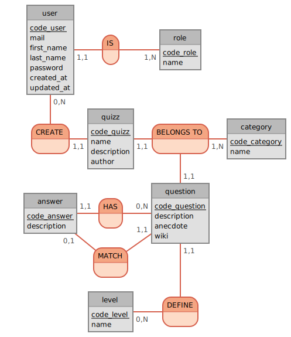

# USER CASE MCD/MLD

## Etude client : Etude vidéo de  la demande

Plateforme quizz pour une école
Chaque élève va pouvoir se connecter pour répondre au quizz

Titre
Auteur
Theme
Sujets
Questions
Reponses
3 Niveaux : debutant, confirmé, expert
Informations => contexte

Visualisation de la BDD
Plateforme de connexion
Validation
Score

Pas besoin de stocker ça, juste savoir ça tout de suite

Structure BDD à voir

(connaît phpMyAdmin)

## Etude client : reformulation

Le client veut une application qui permet de répondre à un quizz qui permet à des élèves d’y répondre.

Les quizz doivent avoir différents thèmes donc différents sujets pour le quizz.
Chaque question va se référer à un sujet.

Celui-ci veut plusieurs thématiques et dans chaque thématique il y aura plusieurs sujets.

Le quizz va être sous forme d’un QCM  avec différentes difficultés : il y aura 3 niveaux de difficultés.

Ces 3 niveaux de difficultés seront :
Débutant
Confirmé
Expert

Les questions seront contextualisées pour les élèves et ces derniers auront accès aux réponses mais aussi à un récapitulatif avec le score à la fin du quizz après validation.

Les scores ne seront pas stockés dans la base de données (? donc pas d’historique)

Chaque élève doit pouvoir s’enregistrer : donc se créer un compte pour s’identifier et se connecter par la suite

Le client dit qu’il connaît déjà “PHPmyAdmin” : on utilise pgAmin, DBeaver, avec PostgreSQL => “on peut lui dire que techniquement, c’est adapté blabla”

Le client souhaite visualiser la BDD avant de commencer : faire un Schéma

## Use cases Version 1.0

| En tant que <type user> | J'ai besoin de | Afin de |
| -- |  -- | -- |
| Visiteur | une page accueil | visualiser le contenu du site |
| Visiteur | une page accueil avec la liste des quizz | choisir le quizz |
| Visiteur | une page accueil avec les auteurs des quizzes | choisir le quizz |
| Visiteur | visualiser les sujets | choisir le quizz |
| Visiteur | un formulaire | authentification |
| Visiteur | ouvrir un page score | pour voir mon resultat |
| Visiteur | visualiser les thèmes | |
| Visiteur | choisir mon quizz (difficulté, theme) | participer au quizz |
| Visiteur | visualiser les thèmes deja fait / pas fait | |
| Visiteur | visualiser la difficulté de chaque questions | |
| Visiteur | visualiser les sujets de chaque quizz / sujet ? | |
| Visiteur | trier/filter les quizz | par thematique/auteur |
| Visiteur | visualiser l'auteur du sujet choisi | |
| Visiteur | page de création de compte | pour s'enregistrer |
| -- |  -- | -- |
| Membre | page de connexion | pour se connecter |
| Membre | page de profil | pour avoir accès à mes données |
| Membre | se connecter | faire mes quizzes |
| Membre | visualiser son score |  |
| Membre | renouveler mon mot de passe | si l'utilisateur a perdu ses identifiants |
| Membre | pouvoir visualiser les bonnes et mauvaises réponses |  |
| -- |  -- | -- |
| Admin | pouvoir avoir un accès en écriture sur les données | afin de rajouter des quizz |

## Faire un schéma du site : Wireframe


## MCD : Modèle conceptuel de données

Identifier les différentes entités (relations) et leurs associations : prendre le besoin client et identier ce dont on a besoin techniquement (tables, champs des tables)

### De quelles entités a-t-on besoin ?

- User (Admin, Membre)
- Question
- Quizz
- Réponse | Answer
- Catégorie | Category
- Niveau | Level
- (Score ?)

### Le nom de nos tables de BDD [Mocodo](http://mocodo.wingi.net/)

### Les Associations (Cardinalités)

// God Object FAIRE ATTENTION et à éviter

- Un admin peut créer un quizz
- Un admin peut créer une question
- Un admin peut créer une catégorie
- Un admin peut créer une réponse

=> Plutôt ça :

- Un auteur peut créer un quizz 1:1 ?????
- Un quiz appartient à une catégorie 1:1
- Une question appartient à un Quizz 1:1
- Plusieurs Questions composent un Quizz N:1
- Réponse appartient a Question 1:1
- Une Question valide une réponse 1:1
- Un Level définit les Questions 1:N
- Une Catégory comporte plusieurs questions 1:N

### Les doutes qu'on a

- Entité: Score (Peut être)
    quizz : QCM ?
    se connecter => choisir un theme => une difficulte => faire le quizz => avoir son resultat => se rater => redoubler
    | Membre | fait un quizz et le termine| proposer un autre quizz | | |
    Précision à demander sur les réponses

### Rappel cardinalités

[Source Cardinalités](https://www.base-de-donnees.com/cardinalites/)

- zero-to-many
- zero-to-one 0:1
- one-to-one 1:1
- one-to-many 1:N
- many-to-one N:1
- many-to-many N:N

On Mocodo Merise method

```js
user: code_user, mail, first_name, last_name, password, created_at, updated_at
IS, 11 user, 1N role
role: code_role, name

:
CREATE, 0N user, 11 quizz
quizz: code_quizz, name, description, author
BELONGS TO, 1N category, 11 question, 11 quizz
category: code_category, name

answer: code_answer, description
HAS, 0N question, 11 answer
question: code_question, description, anecdote, wiki

MATCH, 11 question, 01 answer


:
level: code_level, name
DEFINE, 0N level, 11 question
```

## MLD

### Spécifier les attributs et le typage des attributs

SERIAL = auto increment postgresql

title OR name !!

- user :
  - id INT SERIAL PRIMARY KEY unique
  - mail VARCHAR(255) unique
  - first_name VARCHAR(255)
  - last_name VARCHAR(255)
  - password VARCHAR(255)
  - created_at TIMESTAMP
  - updated_at TIMESTAMP
  - role_id INT foreign key

  Timestamp = date précise

- quizz :
  - id INT SERIAL PRIMARY KEY unique
  - name VARCHAR(255)
  - description VARCHAR(255) (ou TEXT ?)
  - author_id INT foreign key
  - category_id INT foreign key

- question :
  - id INT SERIAL PRIMARY KEY unique
  - description VARCHAR(255) (ou TEXT ?)
  - anecdote TEXT
  - wiki TEXT
  - response_id INT foreign key
  - quizz_id INT foreign key
  - level_id INT foreign key

- answer :
  - id INT SERIAL PRIMARY KEY unique
  - description VARCHAR(255) (ou TEXT ?)
  - question_id INT foreign key

- category :
  - id INT SERIAL PRIMARY KEY unique
  - name VARCHAR(255)

- level :
  - id INT SERIAL PRIMARY KEY unique
  - name VARCHAR(255)

- role :
  - id INT SERIAL PRIMARY KEY unique
  - name VARCHAR(50)

### Associations (ce qu'on peut imaginer ...)



CREATE DATABASE oquizz


CHALLENGE

```sql
CREATE TABLE user IF NOT EXISTS(
  id INT SERIAL PRIMARY KEY,
  mail VARCHAR(255) UNIQUE NOT NULL,
  first_name VARCHAR(255),
  last_name VARCHAR(255),
  password VARCHAR(255),
  created_at TIMESTAMP,
  updated_at TIMESTAMP,
  id_role INT FOREIGN KEY
);

CREATE TABLE role IF NOT EXISTS(
  id INT SERIAL PRIMARY KEY,
  name VARCHAR(50)
);

CREATE TABLE quizz (
  id INT SERIAL PRIMARY KEY,
  name VARCHAR(255),
  description TEXT,
  author VARCHAR(255),
  id_user INT FOREIGN KEY
);

CREATE TABLE category (
  id INT SERIAL PRIMARY KEY,
  name VARCHAR(255)
);

CREATE TABLE answer (
  id INT SERIAL PRIMARY KEY,
  description VARCHAR(255),
  id_question INT FOREIGN KEY

CREATE TABLE question (
  "id" INT SERIAL PRIMARY KEY,
  "description" TEXT,
  "anecdote" VARCHAR(255),
  "wiki" VARCHAR(255),
  "id_category" INT FOREIGN KEY,
  "id_quizz" INT FOREIGN KEY,
  "id_answer" INT FOREIGN KEY,
  "id_level" INT FOREIGN KEY
);

CREATE TABLE LEVEL (
  id INT SERIAL PRIMARY KEY,
  name VARCHAR(255)
);

ALTER TABLE user ADD FOREIGN KEY (id_role) REFERENCES role(id);
ALTER TABLE quizz ADD FOREIGN KEY (id_user) REFERENCES user(id);
ALTER TABLE answer ADD FOREIGN KEY (id_question) REFERENCES question(id);
ALTER TABLE question ADD FOREIGN KEY (id_level) REFERENCES level(id);
ALTER TABLE question ADD FOREIGN KEY (id_answer) REFERENCES answer(id);
ALTER TABLE question ADD FOREIGN KEY (id_quizz) REFERENCES quizz(id);
ALTER TABLE question ADD FOREIGN KEY (id_category) REFERENCES category(id);
```


Si une table existe, on l'enlève

CORRECTION DEFINITIVE

> **Attention à l'ordre de création des tables quand on a des clés étrangères !!!!!!!!**

```sql
-- Eviter tout problème lors de la création
-- Permet de finaliser la création des tables
-- si tout est bien passé c'est ok, sinon on retourne en arrière
-- => Démarrer une transaction
-- TRès important pour les sites e-commerce
BEGIN;


-- Avant de créer quoi qe ce soit
-- Si les tables existent, on les vire
DROP TABLE IF EXISTS "level",
"answer",
"question",
"quiz",
"user",
"tag"

-- timepstamptz enregistre la date avec le fuseau horaire UTC
-- Quand on sélectionne cette date, postgres nous la fournit dans ma timezone
-- qui a été configuré sur le serveur, ou selon la configuration de notre connexion

CREATE TABLE IF NOT EXISTS "level" (
  "id" INTEGER GENERATED BY DEFAULT AS IDENTITY PRIMARY KEY, -- INT SERIAL PRIMARY KEY possible aussi mais plus récent !!!!!!
  "name" TEXT NOT NULL,
  "created_at" TIMESTAMPTZ NOT NULL DEFAULT CURRENT_TIMESTAMP,
  "update_at" TIMESTAMPTZ
)

CREATE TABLE IF NOT EXISTS "answer" (
  "id" INTEGER GENERATED BY DEFAULT AS IDENTITY PRIMARY KEY,
  "description" TEXT NOT NULL,
  "question_id" INTEGER NOT NULL,
  "created_at" TIMESTAMPTZ NOT NULL DEFAULT CURRENT_TIMESTAMP,
  "updated_at" TIMESTAMPTZ
)

CREATE TABLE IF NOT EXISTS "user"(
  "id" INTEGER GENERATED BY DEFAULT AS IDENTITY PRIMARY KEY,
  "email" TEXT NOT NULL,
  "password" TEXT NOT NULL,
  "first_name" TEXT NOT NULL, -- laissé en not null pour ne pas obliger
  "last_name" TEXT NOT NULL, -- l'utilisateur pour la créa
  "created_at" TIMESTAMPTZ,
  "updated_at" TIMESTAMPTZ
)

CREATE TABLE IF NOT EXISTS "quizz" (
  "id" INTEGER GENERATED BY DEFAULT AS IDENTITY PRIMARY KEY,
  "title" TEXT NOT NULL,
  "description" TEXT NULL,
  "user_id" INTEGER NOT NULL REFERENCES "user" ("id"), --! Bien retenir cette forme pour l'ajout des foreign key
  "created_at" TIMESTAMP NOT NULL DEFAULT CURRENT_TIMESTAMP,
  "updated_at" TIMESTAMPTZ
)

CREATE TABLE IF NOT EXISTS "question" (
  "id" INTEGER GENERATED BY DEFAULT AS IDENTITY PRIMARY KEY,
  "question" TEXT NOT NULL,
  "anecdote" TEXT NULL, -- quand on a pas forcément qqch à ajouter
  "wiki" TEXT NULL,
  "level_id" INTEGER NOT NULL REFERENCES "level" ("id"),
  "quizz_id" INTEGER NOT NULL REFERENCES "quizz" ("id"),
--good answer
  "answer_id" INTEGER NOT NULL REFERENCES "answer" ("id"),
  "created_at" TIMESTAMPTZ NOT NULL DEFAULT CURRENT_TIMESTAMP,
  "updated_at" TIMESTAMPTZ
)

CREATE TABLE IF NOT EXISTS "tag" ( --ici remplace les catégories
  "id" INTEGER GENERATED BY DEFAULT AS IDENTITY PRIMARY KEY,
  "name" 
  "created_at" TIMESTAMPTZ NOT NULL DEFAULT CURRENT_TIMESTAMP,
  "updated_at" TIMESTAMPTZ
)

-- Table de liaison
-- Table pivot
-- pivot table
-- prendre la table qui arrive en premier dans l'ordre alphabétique "a_has_z" ou "a_z"
CREATE TABLE IF NOT EXISTS "quizz_has_tag"(
  "id" INTEGER GENERATED BY DEFAULT AS IDENTITY PRIMARY KEY,
  "quizz_id" INTEGER NOT NULL REFERENCES "quizz" ("id"),
  "tag_id" INTEGER NOT NULL REFERENCES "quizz" ("id"),
  "created_at" TIMESTAMP NOT NULL DEFAULT CURRENT_TIMESTAMP,
  "updated_at" TIMESTAMPTZ,
  UNIQUE ("quizz_id", "tag_id") --création une association, crée comme une clé
  --n'enregistre du coup ça qu'une seule fois
  --associe plusieurs quizz à plusieurs tag
)


-- A la fin de la création des tables,
-- on modifie ce qui doit être modifié
-- On ajoute la clé étrangère quand la table référncée a été créée
-- On ne provoquera pas d'erreurs.

--Là c'est pour générer les clés étrangères
ALTER TABLE "answer" ADD FOREIGN KEY ("question_id") REFERENCES "question"("id");

-- Si tout s'est bien passé dans l'analyse des tables
-- On exectue la création !

COMMIT;


```

Annexe : comprendre le thème des quizz

