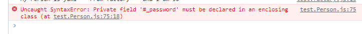
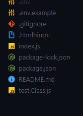
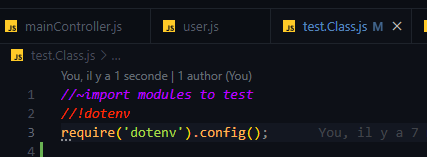
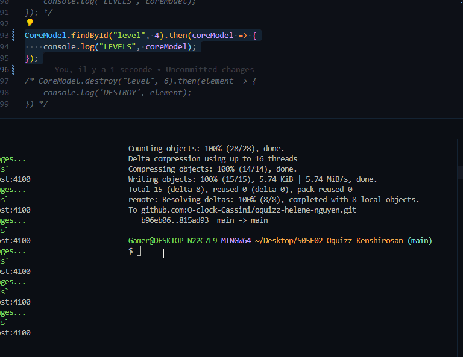
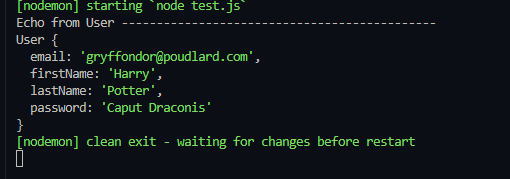
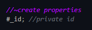
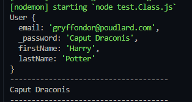

# POO

Programmation Orientée Objet

## Factory, une façon de factoriser son code

Pour ne pas avoir à répéter le même code un nombre incalculable de fois, on peut faire une factory
Une factory est un **objet** qui va nous permettre de créer d'autres objets

## Class : une autre façon de créer les objets et de ne pas répéter

La Class représente une catégorie d'objets, on lui déclare des propriétés et un objet créé par cette classe s'appelle une **instance**

Chaque instance issue de cette classe possèdera ses propriétés.

Définitions :

| ***Class*** | Les ***Class*** sont utilisés pour encapsuler le code donc isoler le code, il s'agit d'une nouvelle façon de créer des objets en respectant la POO. Une ***Class*** n'est PAS un objet mais une fonction qui permet de créer des objets|
| -- | -- |
|||
| ***constructor*** | Quand on crée un ***Class***, on va définir un ***constructor*** qui est une méthode spéciale qui permet par ce biais là d'introduire nos **arguments** :   |
|| - ***this*** est utilisé pour se référer à l'objet en cours et permet donc de "stocker" ces arguments dans *this.ClassName*. C'est grâce à *this* qu'on peut utiliser les propriétés de notre fonction|
|| - Il ne peut y avoir qu'un seul et unique méthode constructeur dans une ***Class*** sinon ça génère *SyntaxError*|
|| - Quand une instance est appelée(crée) et quand on veut créer un nouvel élément en lui passant les arguments, c'est le contructeur qui est appelé en premier lieu car c'est lui qui passera les informations |
|| - L'objet créé peut hériter de nouvelles propriétés (mais vaut mieux les définir dans la fonciton pour une question|
|||
| ***instances*** | Les ***propriétés*** qu'on va définir sont des objets qui sont créés et qui seront par définitions des ***instances***. Quand ont fait appel à eux, on dit qu'ils sont *instanciés*|
|***new***| Grâce à ***new*** on va lui passer les valeurs et va appeler le constructeur pour mettre le tout dedans. Les importantes étapes de ***new*** :|
|| - création d'un nouvel objet à partir de zéro|
|| - liaison de cet objet à un autre objet en le définissant comme *prototype*|
|| - le nouvel objet est passé comme valeur *this* à la fonction|
|| - si la fonction ne renvoie pas d'objet, c'est la valeur *this* qui est renvoyé |

Visualisation du code  :

```js
//~create Class
class Person {

    //~constructor
    constructor(firstName, lastName, age) {
        this.firstName = firstName;
        this.lastName = lastName;
        this.age = age;

    }

    //~object created : instances
    firstName;
    lastName;
    age;

    //~methods
    sayHello() {
        console.log(`My Person is ${this.firstName} ${this.lastName} and I am ${this.age}`);
    }
}

//~export the module
const yumi2 = new Person('yumi', '---From Class---',30);

//~we can also add property in this way
yumi2.pokemon = 'pikachu';
console.log(yumi2);

//~call the method
yumi2.sayHello()


```

### Résultat des tests avec ajout de la propriété "pokemon"


### Getters / Setters

Ou *accessors* et *mutators*

Ces méthodes permettent de cacher les détails de notre objet en instance (par exemple une Class qui va valider une adresse e-mail)

La Class va avoir la fonction de faire un check de ce qu'on va lui envoyer, dire si c'est bon ou non mais on a pas besoin de récupérer la valeur

- Afin de rendre inaccessible une propriété, on peut mettre un ***underscore _*** devant
- Afin de rendre une propriété privée, on peut lui mettre un ***#*** devant

```js

class Person {

    firstName;
    lastName;
    age;
    //add for getters
    _pokemon; //ce qu'on ne veut pas rendre accessible
    #_password; //rendre cette propriété privée avec #
    //on empêche la lecture et l'écriture directement sur ces propriétés
```

Donc là si on crée une nouvelle personne :

```js
const someone = new Person('arg1', 'arg2'...);

console.log(someone.#_password);
//expected output SyntaxError
```



Ici on va créer volontairement une erreur:

- Dans le mutateur on va mettre une condition :

```js
set password(pwd) {
        //on peut faire une vérification comme ça
        if (pwd.length < 6) {
            throw new Error("Wrong password");
            return;
        };
        //on peut faire d'autre test

        this.#_password = pwd;

    };
```

Et là, on va imposer un pwd qui ne correspond pas aux critères

```js
//test
yumi2.password = 'password';
console.log(yumi2.password); //access to the word "password" of property but not THE password

try {
    yumi2.password = 'pass'; //create an error
} catch (error) {
    console.error(error.message);
}
console.log(yumi2.password);

```

Et ça donne ça :


Très bonne source d'info sur les getters et setters : [Ici](https://www.koderhq.com/tutorial/javascript/accessor/)

CONSEIL : NE PAS OUBLIER D'ENLEVER TOUS LES CONSOLE.LOG  QUAND ON DEPLOIE

## Application de la POO

Quand on crée un fichier avec une classe, on met aussi la majuscule sur le fichier si possible, ça dépendra aussi de la société dans laquelle on travaillera

### Héritage

Grâce à ***extends***, la Class enfant hérite des propriétés de la Class parent.

```js
class Admin extends User {
    //exemple author
    is_author = false;

    constructor(is_author) {
        this.is_author = is_author
    }
}

------

//^Create instance Admin
const admin = new Admin('Admin', 'Admin', 'admin@admin.com', 'password', true);
//=> ERROOOOR

```

Ici, on essaye d'appeler l'enfant mais ...


Et en fait le mot ***super()*** nous permet de récupérer le *this* et qui correspondra à la Class parent.

```js
class Admin extends User {
    //exemple author
    is_author = false;

    constructor(firstName, lastName, email, password, is_author) { //!

        //!add super to fetch the keyword "this" !!!
        super(firstName, lastName, email, password); //don't forget to pass info
        
        console.log(this.constructor.length); //! C'est ici ! Qu'on peut récupérer les infos de notre Class

        this.is_author = is_author

    }

```

Et voilà !


Comprendre ***extends*** par un exemple

```js
//~create parent Class
class Vehicle {
    //~create instances
    engine;
    brand;

    //~constructor
    constructor(engine, brand) {
        this.engine = engine;
        this.brand = brand;
    }
}

class Car extends Vehicle {
    //~create instances
    wheels;

    constructor(engine, brand, wheels) {
        super(engine, brand);
        this.wheels = wheels;
    }

}

const vehicle = new Vehicle(); 
const car = new Car("110cv", "Mustang", 4);

console.log(vehicle) //expected output => Vehicle {engine: undefined, brand: undefined}
console.log(car);
```

Donc le log de "car" :


### Petit tips

Si on met console.log alors qu'il y a déjà un console.log dans la méthode, return ***undefined*** parce que ça ne retourne rien


```js
console.log(admin.fullName);
```


### L'importance de instanceof

 ***instanceof*** sert à identifier à quelle classe appartient notre instance (on se pose la question de " c'est le new *Quoi* = ?")

```js

const user2 = new Admin('Admin', 'Admin', 'admin@admin.com', 'password');
console.log(user instanceof User); // apaprtient à User
console.log(user instanceof Admin); // n'appartient pas à Admin

console.log(user2 instanceof User); // appartient aussi à User
console.log(user2 instanceof Admin); // appartient bien à Admin

```


## Correction Challenge

On peut mettre des docs blocks pour donner une information des paramètres utilisés

```
/**
 * {info} info
 */
```

### Test à faire pour vérifier qu'on retourne les valeurs qu'on veut

- Lors de nos tests de requêtes lorsqu'on crée une Class, il est possible  de tester le code en créant un fichier "test.js".
Il suffit ensuite aller dans dossier en cours et lancer nodemon test.js dans le terminal.

Donc le fichier test ici (chez moi test.Class.js):



Ne pas oublier d'importer dotenv :



Et puis lancer nodemon test.Class.js et **TADAAAAM** !

Démo :



```js
const User = require('./user');

const dataObj = {
    email: 'gryffondor@poudlard.com',
    password: 'Caput Draconis',
    firstName: 'Harry',
    lastName: 'Potter'
}

const harry = new User(dataObj); // On met l'objet ici qui sera l'argument du paramètre dataObj dans user

console.log(harry);
```



## Comprendre les objets

Dans le code en dessous, la const dataObj possède un objet avec différents éléments identifié par une clé et une valeur.

On cherche ici mettre un objet dans new User, ça tombe bien !!

```js
//~import modules to test
const User = require('./user');

const dataObj = {
    id: 68,
    email: 'gryffondor@poudlard.com',
    password: 'Caput Draconis',
    firstName: 'Harry',
    lastName: 'Potter'
}

const harry = new User(dataObj);

//REMOVE
console.log(harry);
console.log('-------------------------------------');
console.log(harry.password);
console.log('-------------------------------------');

```

## Comprendre le # devant

Quand on met un # devant, on rend la propriété privée c'est à dire que même avec un console.log, on ne le voit pas apparaître !



Ici le résultat :



Des exemples de vérifications qu'on peut faire :

```js
 if (typeof obj.email !== 'string') {
            throw new Error('User email must be a string');
        }
        if (!emailValidator.validate(obj.email)) {
            throw new Error('User email invalide');
        }
        this.email = obj.email;

        // A vous de définir ce que vous imposez comme format
        //  de mot de passe a l'utilisateur
        if (typeof obj.password !== 'string') {
            throw new Error('User password must be a string');
        }
        if (obj.password.length < 8) {
            throw new Error('User password must be min 8 chars length');
        }
        this.password = obj.password;

        if (typeof obj.firstName !== 'string') {
            throw new Error('User firstName must be a string');
        }
        this.firstName = obj.firstName;

        if (typeof obj.lastName !== 'string') {
            throw new Error('User lastName must be a string');
        }
        this.lastName = obj.lastName;
```
