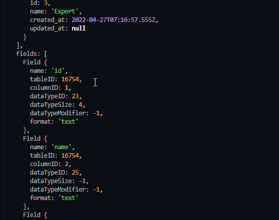
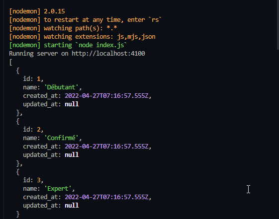
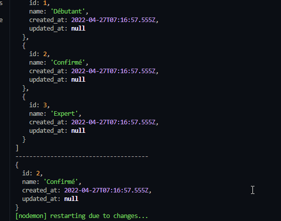
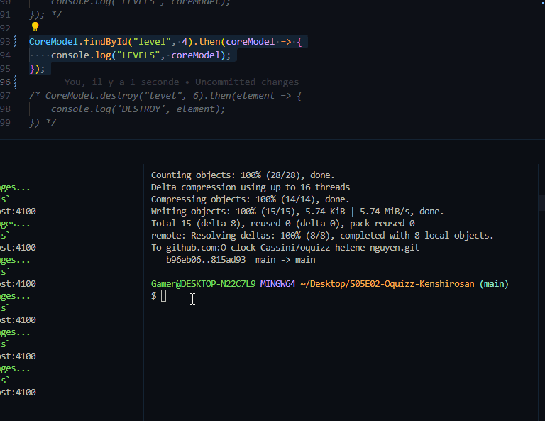

# Architecture

## Qu'est-ce que c'est ?

Les architectures sont des *Design Pattern* c'est à dire un modèle de conception de logiciels et il y en a de différents

### MVC => Model Vue Controller : très très répandue

|**Model**|Tout ce qui rentre dans la base de données est filtré par le modèle. Celui-ci gère les données et la logique métier. L'ensemble des classes qui définissent les objets manipulés contiennent les données et, en général, réalisent les opérations de stockage. C'est la partie qui va protéger l'intégrité des données en implémentant la logique métier|
|-|-|
|**View**|La view permet de gérer la présentation des données donc la disposition et l'affichage|
|**Controller**| Celui-ci intervient entre les deux donc achemine les commandes des parties *model* et *view*, il gère l'aspect dynamique de l'application : il récupère les données avec le *Model**, les injecter dans la vue adéquate, et envoyer la réponse  avec les requêtes *GET* et récupère également les données utilisateurs via les formulaires, les injecte dans un Model, provoque la sauvegarde et renvoie une réponse par le biais des requêtes *POST*|

[Source MVC ici <=](https://developer.mozilla.org/fr/docs/Glossary/MVC)


=> Avantages

- séparation claire des concepts
- DRY : Don't Repeat Yourself un même modèle peut être utilisé par plusieurs views
- DRY : une même view peut être utilisé dans plusieurs contexte (page profil utilisateur admin ou user) donc 2 controller peut nous donner la même view
- Modularité : si on doit changer l'affichage, on a que les views à refaire

|-------------------------------------------------------------------------|
|--|

### SOA => Servie Oriented Architecture, un autre Design pattern


Par exemple le cockpit O'clock


Et d'autres State Action Model (Angular), Micro-services (AWS) etc..

### Utilisation

Pour nos structures de projets, les grandes questions à se poser sont :

Quelques questions à se poser lors de la planification du développement:

- Quelles actions pour mes utilisateurs?
- Quelles routes correspondantes? Est ce que j’ai besoin d’un système de routage?
- Quels controllers pour implémenter ces actions?
- un controller par model? convient pour les applications CRUD (gestion…)
- un controller par vue? convient pour les applications/vues complexes
- un controller par domaine fonctionnel?
- Quelle stratégie pour mes modèles? Est ce que j’ai besoin d’un ORM?
- Quel système de templates?

[Source O'Clock](https://oclock.io/formations)

## Liaison avec la DB : ZONE IMPORTANTE

Il y a 2 grands modèles qui permettent la liaison avec la base de données : Datamapper et Active Record

Exercice : faire la différence entre les 2

Attention !! Avant de faire le test sur le fichier test (pour rappel, c'était [ici](/__docs/ep2_POO.md) pour savoir comment faire les tests), il ne faut pas oublier de :

- configurer son environnement .env
- lier la base de données avec toutes les informations de la DB
- se connecter à la DB avec pg (dans le cas où on est dans l'environnement Node)
- et bien sûr ... faire un require de la DB !

### Datamapper

Datamapper permet de faire les requêtes (Doctrine => Symfony, Alchemy => Python)

Avantages :

- Performances supérieures (moins d'appels à la DB)
- Changement de DB avec facilité

Inconvénient:

- Un peu compliqué pour l'utilisation car beaucoup d'instructions

Tester la DB avec le **Datamapper**

Solution 1

```js
const dataMapper = {
    //all levels
    async getAllLevels() {

        const query = 'SELECT * FROM level';

        client.query(query, (error, results) => {
            if (error) {
                console.log(error);
                return;
            }
            // results : OBJ
            console.log(results);
            if (!results.rowCount) {
                console.log('no results');
                return;
            } 
                //pas besoin de mettre else, erreur de "débutant"
                let levels = [];
                for (let obj of results.rows) {
                    levels.push(new Level(obj));
                

                console.log(levels);
            }
});

```

Ici, on est dans le fichier datamapper, on crée la variable qui permet de faire la requête à la base de données.
On renvoie une erreur s'il y a un problème, sinon on récupère les éléments dans un tableau et on le visualise avec le log.

Résultat de ce qu'on reçoit:



On récupère bien les données.

Autre solution 2 toujours dans le datamapper :

```js
const dataMapper = {
    //all levels
    async getAllLevels() {

        const query = {
            text: `
            SELECT *
            FROM ${TABLE_NAME}`
        }
        const result = await client.query(query);

        return result.rows;
    },
```

Ici les tests ont été fait par le biais d'un main **Controller**

Tout est fait en async/await pour gérer les **Promises**

```js
const mainController = {

    async homePage(req, res) {
        try {
        
            let [allLevels, oneLevel] = await Promise.all([getAllLevels(), getOneLevel(2)]);
      
            console.log(allLevels);

            res.render('home');
        } catch (err) {
            errorController._500(err, req, res);
        }
    }
}
```

Résultat :



Si on veut récupérer qu'un seul level :

```js
    async getOneLevel(id) {
        const query = {
            text: `
            SELECT *
            FROM ${TABLE_NAME}
            WHERE "id" = $1`,
            values: [id]
        }
        const result = await client.query(query);

        return result.rows[0];
    }
```

Et ici dans le mainController :

```js
let [allLevels, oneLevel] = await Promise.all([getAllLevels(), getOneLevel(2)]);
            //REMOVE AFTER TEST        
            console.log(allLevels);
            console.log('--------------------------------------');
            console.log(oneLevel);
```

Résultat dans la console :




### Active Record

Avantages :

- Pas besoin de faire un fichier séparé comme datamapper !
- Facile à utiliser et très intuitif

Inconvénients :

- Un peu moins optimisé, plus d'appels à la DB et donc difficile de changer de DB (refaire les models)

On va utiliser ***Sequelize*** qui est un module Node par la suite.

Etape par étape :

- Etape 1 : Ne pas oublier la connection à la base données pour l'utilisation des données

- Etape 2 : Ne pas oublier de require la DB

- Etape 3 : Manipulation
  - A cette étape on se trouve là où on a créé nos Class
  - Afin de récupérer les données de la DB, on va devoir faire des *methodes*

Code dans notre Class :

  ```js
  static async findAll(table) {

        const query = {
            text: `
            SELECT *
            FROM "${table}"`
        }
        const result = await client.query(query);

        return result.rows;
    };
  ```

Dans la *méthode* findAll(), on le fait sous forme de **requête préparée** pour protéger notre DB contre toute tentative d'*injection SQL* qui parfois, peuvent détruire notre DB !

Ici pour la méthode findAll(), on peut la définir comme une méthode **static**, cela veut dire que la méthode ne s'applique qu'à la classe elle-même et PAS à ses *instances* ! On les utilise en général pour créer des fonctions utilitaires.

Il en est de même pour un findOne() ou destroy(), les *instances* ne sont pas impliquées.

[Source d'infos géniale ici](https://developer.mozilla.org/fr/docs/Web/JavaScript/Reference/Classes/static)

**static** permet de récupérer les infos de la DB SANS avoir à les instancier

Par exemple, ici on va sur test require notre model :

```js
    const Level = require('../models/levels');
```

Et après ... dans le même fichier

```js
Level.findAll()
```

Et TADAAAAM :



Et si on avait voulu le mettre dans le controller dans notre **try catch**:

```js
console.log(await Level.findAll());
```

Et de même du coup pour findOne() ou findById() :

```js
    static async findById(id) {
        const query = {
            text: `
            SELECT *
            FROM ${TABLE_NAME}
            WHERE "id" = $1`,
            values: [id]
        }

        const result = await client.query(query);

        return result.rows[0];
    }
```

Ici dans le controller :

```js
console.log(await Level.findById(4));
```

## Les méthodes en version callback

```js
static findAll() {
        // Sans oublier user entre guilemets
        const query = 'SELECT * FROM "user"';

        // La méthode query : 1er argument : On dit au client d'exécuter la requête.
        // 2eme argument, une fonction callback qui accepte une erreur et les résultats
        client.query(query, (error, results) => {
            // Tout de suite on gère l'erreur éventuelle
            // Si on a une erreur, on la log et on quitte.
            if (error) {
                console.error(error);
                return false;
            }

            // Si on obtient un résultat
            // On vérifie que les données sont présentes
            if (!results.rowCount) {
                // Si on a pas de données, on s'arrête (donc si enregistrement non trouvé)
                console.log('no results');
                // return coupe l'exécution du code
                // On a pas besoin du else
                return false;
            } 
                let users = [];
                for (let obj of results.rows) {
                    users.push(new User(obj));
                }
                //autre solution pour l'array : return result.rows.map(obj => new User(obj));

                // Ici on devrait return les data
                console.log(users);
            
        });
    }
```
