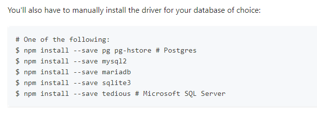

# ORM : Object Relationnal Mapping

(or Object Relationnal Mapper)

C'est une librairie qui va nous mettre de code plus facilement, ça supporte Active Record ou Datamapper

On va l'utiliser avec Active Record

C'est CoreModel mais en mieux !

- Mettre en place les Models rapidement
- Créer les tables correspondante (en synchronisant automatiquement)
- Pourvoir changer de DB (en SQL) sans s'embêter des différences de SGBDR
- Gérer les types et les contraintes (donc les validations)
- Mettre à jour et modier la SDB de façon cadrée et réversible (donc faire des migration)
- Se connecter à plusieurs serveurs de DB en même temps (pour la réplication, donc pour protéger les données et rediriger les requêtes pour accélerer)
- Gérer les ***relations*** entre les modèles (donc les tables et les **associations**)

## Sequelize

```shell
npm i sequelize
```

Attention !! Pour que Sequelize fonctionne, il lui faut un driver !
(exemple : "pg" pour postgres, mysql2 pour "mysql", "maradb" pour mariadb etc..)



[Source Sequelize Documentation](https://sequelize.org/docs/v6/)

Si on veut vérifier qu'un module existe :

```shell
npm search [nom module]
```

### Faire la connexion avec la base de données

- Créer un fichier getConnexion (comme le fichier 'database.js' ou 'client.js' lorsqu'on utilisait datamapper) où on va créer la connexion grâce à notre module dotenv.

- Dans notre .env :

Dans .env, on va mettre en place les éléments permettant la connexion avec la DB :

```txt
#List our variables
DB_NAME=oquiz
DB_USERNAME=oquiz
DB_PASSWORD=oquiz
DB_HOST=localhost
DB_ENV=postgres

```

- Ensuite, on va s'y connecter.
Modèle type pour la connexion :

```js
//!
require('dotenv').config();
//~import modules
const Sequelize = require('sequelize');

//~connexion database
function getConnexion() {

    return new Sequelize(
        process.env.DB_DATABASE,
        process.env.DB_USERNAME,
        process.env.DB_PWD,

        {
            define: {
                createdAt: "created_at",
                updatedAt: "updated_at"
            },

            host: process.env.DB_HOST,
            dialect: process.env.DB_ENV,
            logging: false
        }
    )
}

module.exports = getConnexion;

```

- Puis on va créer nos Models et grâce à Sequelize, on peut avoir des requêtes héritées natives et simples à utiliser dans nos controllers !

### Création d'une Class avec Sequelize

```js
//~import modules
const {
    Sequelize,
    Model,
    DataTypes,
    Op,
    literal
} = require('sequelize');
//~connect DB
const sequelize = require('./getConnexion')();

class Level extends Model {};

Level.init({
    //~relations
    id: {
        type: Sequelize.INTEGER,
        unique: true,
        autoIncrement: true,
        primaryKey: true
    },
    name: {
        type: Sequelize.STRING
    },
    created_at: {
        type: Sequelize.DATE,
        allowNull: false,
        defaultValue: literal('CURRENT_TIMESTAMP')
    },
    updated_at: {
        type: Sequelize.DATE,
        allowNull: true
    }

}, {
    sequelize,
    tableName: 'level'
});

module.exports = Level; 

```

allowNull est par défaut *true*

[Source pour les datatypes](https://sequelize.org/docs/v7/other-topics/other-data-types/)

(DataTypes.STRING, => par défaut VARCHAR(255))

- Et enfin, dans notre controller, on va pour voir utiliser les requêtes qui sont sécurisées grâce à Sequelize!

Deux façons d'écrire :

```js
const mainController = {

    async homePage(req, res) {
        //then/catch
        /* Level.findAll()
            .then((data) => {
                console.log(data);
            })
            .catch((err) => {
                console.error(err);
            })
            .finally(() => {
                console.log('requête terminée');
            });
        res.render('home'); */

        //try/catch
        try {
            const levels = await Level.findAll();
            /* console.log(data); */
            res.render('home', { levels });
            
            
        }
        catch (err) {
            errorController._500(err, req, res);
        }
    }
```

[Infos des 10 failles de sécurité les plus connues ici](https://owasp.org/Top10/)
